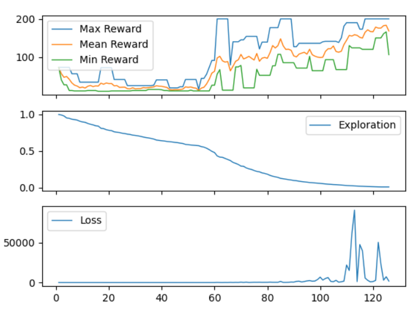

# RL-Projects

Introduction of Reinforcement Learning from OpenAI gym library

Created homemade Framework (only DQN for the moment) in order to :
  - Master every mathematical aspects of the algorithm
  - Garantee that Agents are compatible to any environment (DQN will later be used to create a Coinbase Bot)
  
Results on Homemade DQN using Cartpole Environment in gym (Maximum Reward 200):

